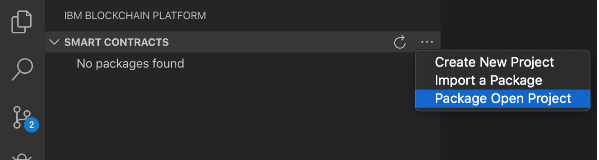

# Deploy Application using IBM Blockchain Platform VS Code Extension

This code pattern showcases blockchain-enabled crowdfunding by showing you how to use a Hyperledger Fabric network to build a platform to aid crowdfunding. This network provides a holistic view of the requirement and its current status -- which helps to address the need more efficiently, and reduces the problems of over-collection or under-collection for a need. 


## Flow Diagram


1. Setup Blockchain Network using IBM Blockchain Platform(IBP) VS Code Extension.
2. Deploy the client application using Fabric Node SDK. It works as middle layer and exposes REST API.
3. Deploy Web UI application built using NodeJs.
4. User can perform following task using the web interface which internally interacts with Blockchain Network with the help of middle layer.
   * Current status of Funds raised
   * Donate for the cause
   * View all Supporters who have donated

## Steps

Please follow the steps to run this application.

### 1. Clone the repository

  ```
   git clone https://github.com/IBM/blockchain-enabled-crowdfunding
   ```

### 2. Setup IBP extension on VS Code

Install IBP extension in VS Code.

### 3. Package the Smart Contract

* Create directory as:
  ```
  mkdir -p $HOME/chaincode/src/demo
  ```
  
* Copy the smart contract `chaincode/crowdfunding.go` in `$HOME/chaincode/src/demo/`. 

* Ensure paths are set correctly. GOPATH as `$HOME/chaincode`, GOROOT as `< go install directory >`, and PATH has `$GOROOT/bin`.
  
* Open the `demo` folder in VS Code.

* Click the `IBM Blockchain Platform` extension button. This will show the packaged contracts on top.

* Next, click on the 3 dots and select `Package Open Project`.

  

* You will be prompted for the package name and version. It’s important to provide the proper version as the smart contract can then be upgraded to deploy a newer version. After you’ve provided this information, the smart contract package will be created.

* In the left navigation panel, you should be able to see a .cds file named `<package name>@<version>`.
  

### 4. Start the Fabric Network

Now you are ready to deploy to the local fabric network. Before you can install the smart contract on the network, you need to first connect to a network.

* Start the Fabric network (if not done yet) using FABRIC ENVIRONMENTS on the left side of the editor.

* Once the provisioning is finished and the network is up and running, you will see this in VSCode:

  
  
### 5. Install and Instantiate the Smart Contract

***Install***
* In the FABRIC ENVIRONMENTS section, click on `Smart Contracts > Installed > Install`. 

* Select the packaged contract in the pop-up.

* After the install is complete, you should see that the contract is listed under Installed under FABRIC ENVIRONMENTS.

***Instantiate***
* In the FABRIC ENVIRONMENTS section, click on `Smart Contracts > Instantiated > Instantiate`.

* Choose the installed smart contract to instantiate.

* The extension will then ask you which function to call on instantiate - type `init`.

* Next, it will ask you for the arguments to the function. There are none, so just hit enter.

* The extension will then ask you *do you want to use a provide a private data collection configuration file?* - Click on `no`.

* Lastly, the extension will then ask you do you want to choose a smart contract endorsement policy. Choose Default (single endorser, any org).

Once instantiation of the contract completes, you should see contract name under Instantiated under FABRIC ENVIRONMENTS.

### 6. Test the transactions

You can test out the transactions right in the VSCode platform using the `Fabric Gateways` section.

### 7. Get/Update the connection profile

Get connection profile and copy to `local` directory provided in github repository.
In this repository, a sample connection profile is already provided. Need to change the name/ports wherever required.

### 8. Deploy Client Application

The middle-layer uses the Hyperledger Fabric SDK to communicate with a blockchain network. Build the client application using Fabric Node SDK. To start that, perform the following steps.

* Go to directory `fabric-node-sdk-app`
* Open file `routes/index.js`
* Check `CA` settings at `line 205-211`
* Check chaincode name and version at `line 219-221`
* Save the file

Go to terminal and execute following steps.

  ```
  cd fabric-node-sdk-app
  npm install
  PORT=30001 DEPLOY_TYPE=local npm start
  ```
You should see the message on your terminal as - `Successfully enrolled admin user "admin"`.

### 9. Deploy webapp

* Run the webapp using the following commands.

  ```
  cd node-webapp
  npm install
  npm start
  ```
  
### Access the Application and Perform transactions

* Access the application

  You can access the webapp at `http://localhost:3000`. You should see the following on your browser.

  

Using this application you can perform the transactions to monitor the funds raised, donate the money and view the contributors.

