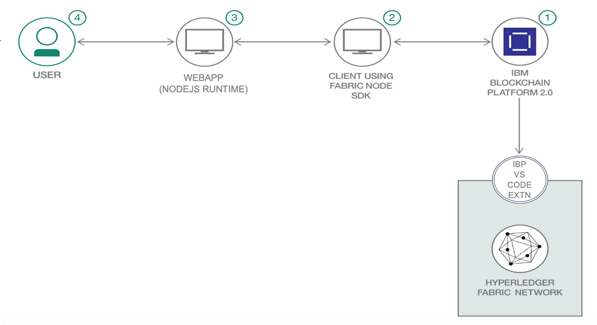

# Deployment using IBP Extension on VSCode

This code pattern showcases blockchain-enabled crowdfunding by showing you how to use a Hyperledger Fabric network to build a platform to aid crowdfunding. This network provides a holistic view of the requirement and its current status -- which helps to address the need more efficiently, and reduces the problems of over-collection or under-collection for a need. 

## Flow Diagram



## Steps

Please follow the steps to run this application.

* Clone the repository

  ```
   git clone https://github.com/IBM/blockchain-enabled-crowdfunding
   ```

* Setup IBP extension on VS Code

* Package the Smart Contract

* Install and Instantiate the Smart Contract

* Get connection profile and copy to `local` directory provided in github repository.

* Build the client application using Fabric Node SDK. To start the server, perform the following steps.

  ```
  cd backend
  npm install
  PORT=30001 DEPLOY_TYPE=local npm start
  ```
  
* Run the webapp.

  ```
  cd webapp
  npm install
  npm start
  ```
* Access the application

  You can access the webapp at `http://localhost:3000`. You should see the following on your browser.

  

Using this application you can monitor the funds raised, donate the money and view the contributors.

