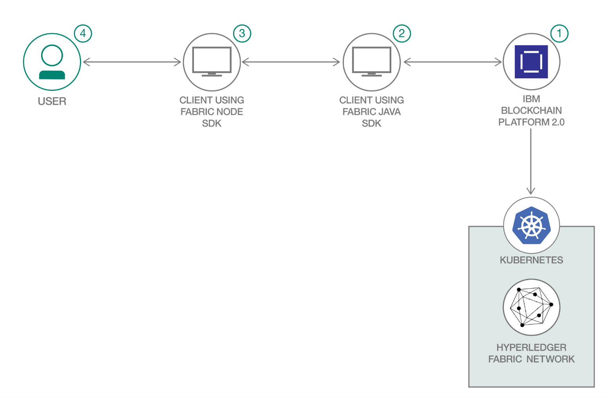
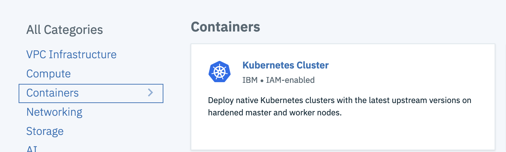
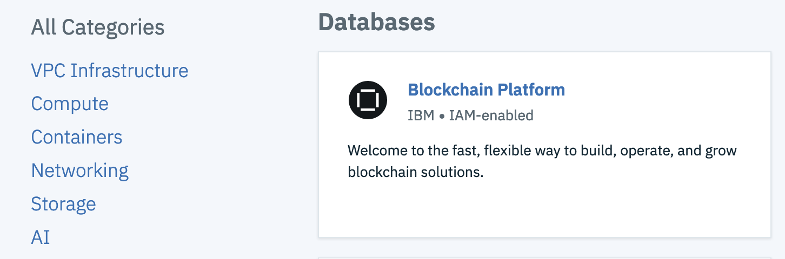
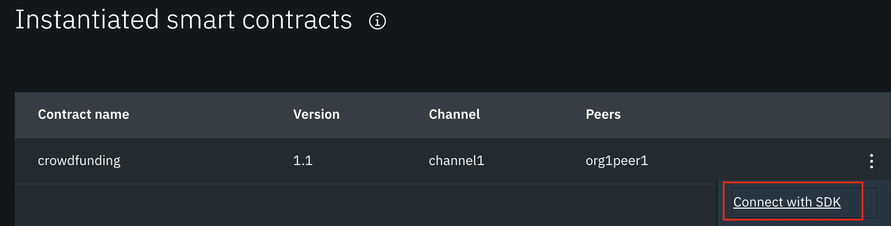
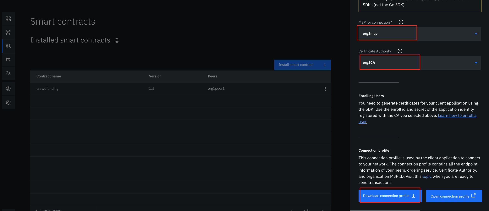

 
# Build a network to support blockchain-enabled crowdfunding
**Demonstrate the use of Hyperledger Fabric for building a collaborative crowdfunding platform**

Crowdfunding is practice of funding that operates independently of any government and is a way for people, businesses and charities to raise money. It is a way of raising finance by asking a large number of people each for a small amount of money. People invest simply because they believe in the cause. There are several types of crowdfunding (donation based, rewards based, debt, equity) but not all types of crowdfunding are regulated by government organizations like the UK's Financial Conduct Authority.

Crowdfunding has many benefits, but it also comes with a substantial risk of fraud -- as well as a number of potential risks, such as loss of money, locked-in investment, lack of income, and lack of information. Many people worry about being scammed by a fraudulent request, due in large part to crowdfunding's lack of transparency and trust. There have been few reported cases of fraud in crowdfunding -- particularly when compared to the number of transactions and amounts involved -- however as the number of crowdfunding platforms grows, so does the risk that platform operators themselves may engage in or enable fraud.

This code pattern showcases blockchain-enabled crowdfunding by showing you how to use a Hyperledger Fabric network to build a platform to aid crowdfunding. This network provides a holistic view of the requirement and its current status -- which helps to address the need more efficiently, and reduces the problems of over-collection or under-collection for a need. All of this means that the platform creates trust, accountability, and operational transparency.

In this code pattern, we have taken an example of the crowdfunding event - **"Raise funds to increase Green Cover"**.

When the reader has completed this code pattern, they will understand how to:

- Setup blockchain network using IBM Blockchain Platform(IBP)
- Interact with IBP using Fabric Java SDK
- Build a nodejs client application which will interact with blockchain network with the help of Fabric Java SDK application

# Flow



1. Setup Blockchain Network using IBM Blockchain Platform on IBM Cloud.
2. Deploy the client application using Fabric Java SDK. It works as middle layer and exposes REST API.
3. Deploy Web UI application built using NodeJs.
4. User can perform following task using the web interface which internally interacts with Blockchain Network with the help of middle layer.
   * Current status of Funds raised
   * Donate for the cause
   * View all Supporters who have donated


# Pre-requisites

* [IBM Cloud Account](https://cloud.ibm.com)
* [Git Client](https://git-scm.com/downloads) - needed for clone commands.
* [Maven](https://maven.apache.org/install.html) - needed to build the client. Maven is a build automation tool used primarily for Java projects.
* [IBM Cloud CLI](https://cloud.ibm.com/docs/cli?topic=cloud-cli-getting-started)

# Steps

Follow these steps to setup and run this code pattern. The steps are described in detail below.

1. [Get the code](#1-get-the-code)
2. [Create IBM Cloud Services](#2-create-ibm-cloud-services)
3. [Setup Hyperledger Fabric Network using IBM Blockchain Platform](#3-setup-hyperledger-fabric-network-using-ibm-blockchain-platform)
4. [Build the client application using Fabric Java SDK](#4-build-the-client-application-using-fabric-java-sdk)
5. [Build and deploy webapp](#5-build-and-deploy-webapp)
6. [Analyze the Results](#6-analyze-the-results)

## 1. Get the code

- Clone the repo using the below command.
   ```
   git clone https://github.com/IBM/blockchain-enabled-crowdfunding
   ```

 - In this repository,
    * [Chaincode ](https://github.com/IBM/blockchain-enabled-crowdfunding/tree/master/chaincode):
    Go lang based smart contract with application logic that has to be installed on the network.
    * [Client code using Fabric Java SDK](https://github.com/IBM/blockchain-enabled-crowdfunding/tree/master/fabric-java-sdk-app): application code built using Fabric Java SDK to invoke and query chaincode on the hyperledger fabric network. The operations are exposed as REST APIs when deployed enabling other applications to consume.
    * [Web application code](https://github.com/IBM/blockchain-enabled-crowdfunding/tree/master/webapp): NodeJS based application code to render UI and integrates with the REST APIs exposed by the client application built on Fabric Java SDK.

## 2. Create IBM Cloud Services

**Create IBM Kubernetes Service**

Create a Kubernetes cluster with [Kubernetes Service](https://cloud.ibm.com/containers-kubernetes/catalog/cluster) using IBM Cloud Dashboard. This pattern uses the _free cluster_.

  

  > Note: It can take up to 15-20 minutes for the cluster to be set up and provisioned.  

**Create IBM Blockchain Platform Service**

Create [IBM Blockchain Platform service](https://cloud.ibm.com/catalog/services/blockchain-platform) instance using IBM Cloud Dashboard.

 
 
## 3. Setup Hyperledger Fabric Network on IBM Blockchain Platform on IBM Cloud

In this step, we will setup the Hyperledger Fabric network using IBM Blockchain Platform as explained below. 

### Create Hyperledger Fabric Network on IBM Blockchain Platform

Follow this [tutorial](https://developer.ibm.com/tutorials/quick-start-guide-for-ibm-blockchain-platform/) to create fabric network using IBM Blockchain Platform. The blockchain network should consist of two organizations with single peer each and an orderer service for carrying out all the transactions. 

### Deploy Smart Contract on IBM Blockchain Platform

Smart contract(chaincode) is available [here](https://github.com/IBM/blockchain-enabled-crowdfunding/tree/master/chaincode).

**Package the smart contract**

To package follow the instructions provided [here](https://developer.ibm.com/tutorials/quick-start-guide-for-ibm-blockchain-platform/) as step 12. For your convenience, packaged smart contract(.cds) is also provided in repo under `chaincode` directory. You can use this file directly to install smart contract.

**Install and Instantiate smart contract**

- Install smart contract using the `.cds` file generated/downloaded as explained in previous step.
- Instantiate the smart contract. Function name to be provided during instantiation is `init` and no parameters OR we can leave it blank as we are using the default function name (init) only.

**Download connection profile**

Instantiation of smart contract has to be followed by integrating the blockchain network with Fabric Java SDK. Follow the below steps to download `Connection Profile`.

* Under `Instantiated smart contracts` section, click on the three vertical dots for your smart contract as shown. Click on `Connect with SDK` option.

  
  
* Provide the `MSP name` and `Certificate Authority`. Scroll down and click on `Download Connection Profile`.

  

* Rename the downloaded json file as `connection_profile.json`.
* Place this file in `fabric-java-sdk-app/src/main/resources/`. It gets loaded through `ConnectionProfileLoader.java`

## 4. Build the client application using Fabric Java SDK

Here, we use the [Fabric Java SDK App](https://github.com/IBM/blockchain-enabled-crowdfunding/tree/master/fabric-java-sdk-app) to build a client to invoke and query chaincode on the hyperledger fabric network.

Open the `manifest.yml` file under `fabric-java-sdk-app` directory. Under `env` section, provide the valid credentials for an user who can execute transactions in the network. Also update Organization Affiliation and Chaincode name.

```
applications:
- name: blockchain-enabled-crowdfunding-java
  random-route: true
  memory: 1024M
  path: target/crowdfunding-java.war
  buildpack: java_buildpack
  env:
    admin: <admin-username>
    adminpw: <admin-password>
    OrgAffiliation: <affiliation>
    ChainCodeName: <Chaincode-Name>
```
> Note: In this pattern, we are using admin credentials directly for executing transactions.

Next, on the command terminal go to `blockchain-enabled-crowdfunding` directory, and execute the below commands:
```
  cd fabric-java-sdk-app
  mvn clean install
  ibmcloud cf push
```
Login to `IBM Cloud`. On the `Dashboard`, verify that an app `blockchain-enabled-crowdfunding-java` is running fine.

Make a note of this Fabric Java SDK client application's url. On IBM Cloud dashboard, click on the application. When application page opens, click on `Visit App URL`. Now make a note of the url, as shown on the browser, even if the page shows some error. If the url ends with a `/` then remove the trailing forward slash. This url should be provided in web application that interacts with this Fabric Java SDK client application.

## 5. Build and deploy webapp

A web application is provided to perform various operations like `Donate`, `View Supporters` etc. Web application code can be found under `webapp` directory.

This web application invokes rest interfaces implemented in Fabric Java SDK client application as explained above. Hence the web application needs Fabric Java SDK client application url for rest invocations.

Perform the following steps:

- Run the below command.
  ```
  cd webapp
  ```
  
- Update the Java application url (as noted in section 3) in `config.js` file of `webapp` directory. 

- Deploy the application to IBM Cloud using the command:
  ```
  ibmcloud cf push
  ```
  Deployment might take a few minutes to complete. Ensure that there are no errors while deploying the application.

## 6. Analyze the Results

Login to `IBM Cloud`. On the `Dashboard`, verify that an app `blockchain-enabled-crowdfunding-webui` is running fine. Click on the web application entry. When application page opens, click on `Visit App URL`. Web application page opens.

It shows the crowdfunding project details, current status of funds raised and the tasks that you can perform. To donate, click on `Donate`. Provide the required details and click on `Donate Now` to donate. Click on `View Supporters` to view the list of supporters who have donated.


> *Note: The images used in UI are downloaded from internet which are free to use and share.*

# Learn More

- [IBM Blockchain Platform - Quick start guide](https://developer.ibm.com/tutorials/quick-start-guide-for-ibm-blockchain-platform/)
- [How-to use Fabric Java SDK with a TLS-enabled Hyperledger Fabric Network](https://developer.ibm.com/tutorials/hyperledger-fabric-java-sdk-for-tls-enabled-fabric-network/)
- [Learn about Crowdfunding](https://en.wikipedia.org/wiki/Crowdfunding)

<!-- keep this -->
## License

This code pattern is licensed under the Apache Software License, Version 2. Separate third-party code objects invoked within this code pattern are licensed by their respective providers pursuant to their own separate licenses. Contributions are subject to the [Developer Certificate of Origin, Version 1.1 (DCO)](https://developercertificate.org/) and the [Apache Software License, Version 2](https://www.apache.org/licenses/LICENSE-2.0.txt).

[Apache Software License (ASL) FAQ](https://www.apache.org/foundation/license-faq.html#WhatDoesItMEAN)
